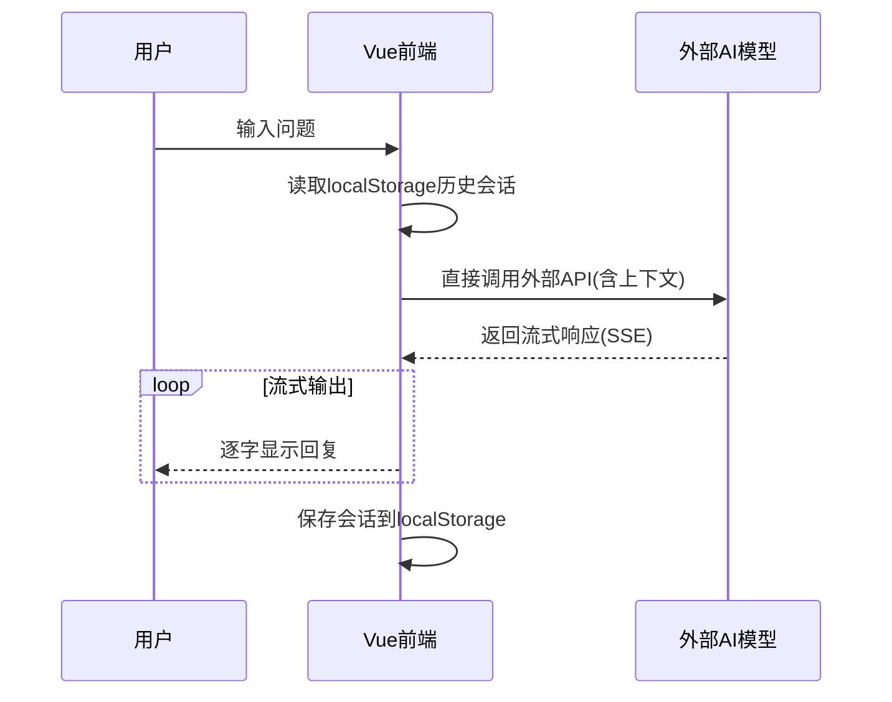

# AI聊天助手产品需求文档（PRD）

## 1. 产品概述

### 1.1 产品定位
**产品名称**：ChatFlow  
**定位描述**：一款简洁现代的AI聊天助手，专注于提供高质量的对话体验，通过调用外部AI大模型接口实现智能问答功能。纯前端实现，无需后端服务。

### 1.2 核心价值主张
- **简洁优雅**：极简设计风格，无冗余功能，专注核心对话体验
- **快速响应**：毫秒级响应速度，流畅的流式输出
- **智能交互**：支持多轮对话记忆、多模态输入
- **轻量灵活**：纯前端技术栈，易于部署和维护

### 1.3 目标用户
| 用户画像 | 需求场景 |
|---------|---------|
| 普通用户 | 日常聊天、知识查询、内容创作 |
| 职场人士 | 文档处理、会议纪要、报告撰写 |
| 开发者 | 代码生成、技术文档、API调用 |
| 学生 | 学习辅导、论文写作、资料整理 |

---

## 2. 核心功能需求

### 2.1 P0级功能（必须具备）

| 功能模块 | 功能点 | 需求描述 | 优先级 |
|---------|-------|---------|--------|
| **基础对话** | 文本输入 | 用户可在输入框输入文本问题 | P0 |
| | 流式输出 | AI回复实时逐字显示，提升交互体验 | P0 |
| | 多轮记忆 | 保持会话上下文，支持多轮对话 | P0 |
| | 响应速度 | 首响应<500ms，整体<1s | P0 |
| **对话管理** | 会话列表 | 左侧展示历史会话，支持搜索 | P0 |
| | 会话命名 | 自动/手动命名会话标题 | P0 |
| | 删除会话 | 支持删除单个或多个会话 | P0 |
| **本地存储** | 会话持久化 | 使用localStorage存储会话记录 | P0 |
| **API配置** | 密钥管理 | 用户可配置外部AI模型API密钥 | P0 |

### 2.2 P1级功能（建议具备）

| 功能模块 | 功能点 | 需求描述 | 优先级 |
|---------|-------|---------|--------|
| **内容创作** | 写作模式 | 支持长文本创作，提供写作模板 | P1 |
| | 翻译功能 | 支持多语言翻译 | P1 |
| | 代码生成 | 支持主流编程语言代码生成 | P1 |
| **搜索增强** | 联网搜索 | 支持实时联网获取最新信息 | P1 |
| **个性化设置** | 主题切换 | 支持深色/浅色主题 | P1 |
| | 字体大小 | 支持调整字体大小 | P1 |

### 2.3 P2级功能（可选扩展）

| 功能模块 | 功能点 | 需求描述 | 优先级 |
|---------|-------|---------|--------|
| **语音交互** | 语音输入 | 支持语音转文字输入 | P2 |
| | 语音输出 | 支持文字转语音播放 | P2 |
| **分享功能** | 会话分享 | 支持分享会话链接 | P2 |
| **数据导出** | 导出记录 | 支持导出会话记录 | P2 |

---

## 3. 交互与UI设计

### 3.1 设计风格
- **整体风格**：极简现代，清爽简洁
- **配色方案**：白底黑字为主，蓝色(#3B82F6)作为主色调
- **字体**：系统默认字体，清晰易读

### 3.2 页面布局

```
┌─────────────────────────────────────────────────────┐
│  顶部导航栏                                         │
│  ┌─────────────┐  ┌──────────────┐  ┌──────────┐   │
│  │ Logo + 名称 │  │  搜索框      │  │ 设置按钮 │   │
│  └─────────────┘  └──────────────┘  └──────────┘   │
├─────────────────────────────────────────────────────┤
│  主体区域                                           │
│  ┌──────────┐  ┌─────────────────────────────────┐ │
│  │ 会话列表 │  │         聊天窗口                │ │
│  │ (可折叠) │  │  ┌─────────────────────────┐   │ │
│  │          │  │  │  用户消息气泡            │   │ │
│  │  + 新建  │  │  │  AI消息气泡(流式输出)    │   │ │
│  │  会话A   │  │  └─────────────────────────┘   │ │
│  │  会话B   │  │                               │ │
│  └──────────┘  │  ┌─────────────────────────┐   │ │
│                │  │  输入框 + 发送按钮       │   │ │
│                │  └─────────────────────────┘   │ │
│                └─────────────────────────────────┘ │
└─────────────────────────────────────────────────────┘
```

### 3.3 核心交互流程



### 3.4 界面细节

#### 3.4.1 聊天窗口
- **消息气泡**：用户消息左对齐浅灰色，AI消息右对齐蓝色
- **流式动画**：打字机效果，逐字显示
- **状态提示**："正在思考..."加载动画
- **代码高亮**：代码块支持语法高亮

#### 3.4.2 输入区域
- **布局**：左侧输入框 + 右侧发送按钮
- **快捷键**：Ctrl+Enter换行，Enter发送

#### 3.4.3 会话列表
- **卡片式设计**：显示会话标题和预览内容
- **搜索功能**：支持按内容搜索历史会话
- **最近会话**：按时间排序，置顶显示

#### 3.4.4 设置面板
- **API配置**：输入智谱AI API密钥、API地址、模型名称
- **主题切换**：深色/浅色主题切换开关
- **字体设置**：字体大小调节

---

## 4. 技术方案

### 4.1 技术栈

| 层级 | 技术 | 说明 |
|-----|------|------|
| 前端框架 | Vue 3 + TypeScript | 组合式API，类型安全 |
| 样式 | TailwindCSS 3 | 快速开发，响应式设计 |
| 状态管理 | Vue Composition API | 轻量响应式状态 |
| 图标 | Lucide Vue | 现代图标库 |
| 代码高亮 | Prism.js | 代码语法高亮 |
| 存储 | localStorage | 会话数据本地持久化 |

### 4.2 架构设计

```
┌─────────────────────────────────────────────────────┐
│              Vue 3 前端应用                         │
│  ┌─────────────┐  ┌─────────────┐  ┌───────────┐   │
│  │ ChatPanel   │  │ Sidebar     │  │ Settings  │   │
│  │ (聊天窗口)  │  │ (会话列表)  │  │ (设置面板)│   │
│  └──────┬──────┘  └──────┬──────┘  └─────┬─────┘   │
│         │                │               │          │
│         └────────────────┼───────────────┘          │
│                          ▼                          │
│              ┌───────────────────┐                  │
│              │   状态管理        │                  │
│              │ (Composition API) │                  │
│              └────────┬──────────┘                  │
│                       │                             │
└───────────────────────┼─────────────────────────────┘
                        │ HTTP(S)
                        ▼
┌─────────────────────────────────────────────────────┐
│             智谱AI GLM模型接口                       │
│      glm-4-flash / glm-4 / glm-4-plus               │
└─────────────────────────────────────────────────────┘
```

### 4.3 项目结构

```
src/
├── components/
│   ├── ChatPanel.vue      # 聊天窗口组件
│   ├── MessageBubble.vue  # 消息气泡组件
│   ├── Sidebar.vue        # 左侧会话列表
│   ├── InputArea.vue      # 输入区域
│   ├── Settings.vue       # 设置面板
│   └── LoadingDots.vue    # 加载动画
├── composables/
│   ├── useChat.ts         # 聊天逻辑
│   ├── useStorage.ts      # 本地存储
│   └── useTheme.ts        # 主题切换
├── types/
│   └── index.ts           # 类型定义
├── utils/
│   └── api.ts             # API调用封装
├── App.vue
├── main.ts
└── style.css
```

### 4.4 核心数据结构

```typescript
// 消息类型
interface Message {
  id: string;
  role: 'user' | 'assistant';
  content: string;
  timestamp: number;
}

// 会话类型
interface Conversation {
  id: string;
  title: string;
  messages: Message[];
  createdAt: number;
  updatedAt: number;
}

// 设置类型
interface Settings {
  apiKey: string;
  apiBaseUrl: string;
  model: string;
  theme: 'light' | 'dark';
  fontSize: 'small' | 'medium' | 'large';
}
```

---

## 5. 非功能需求

### 5.1 性能指标
| 指标 | 目标值 |
|------|-------|
| 首响应时间 | <500ms |
| 平均响应时间 | <1s |
| 页面加载时间 | <2s |

### 5.2 安全性
- API密钥存储在localStorage（仅本地）
- HTTPS协议传输（部署时）
- 敏感内容过滤

### 5.3 兼容性
- 支持主流浏览器（Chrome、Firefox、Safari、Edge）
- 响应式设计，支持移动端

---

## 6. 项目计划

### 6.1 里程碑

| 阶段 | 时间 | 目标 |
|------|------|------|
| 第一阶段 | 1周 | 项目初始化、UI框架搭建 |
| 第二阶段 | 1周 | 基础对话功能、流式输出 |
| 第三阶段 | 1周 | 会话管理、本地存储 |
| 第四阶段 | 1周 | 设置面板、主题切换 |
| 第五阶段 | 1周 | 测试优化、部署上线 |

### 6.2 资源需求
- 前端开发：1人
- UI设计：1人（可兼）

---

## 7. 风险评估

| 风险 | 可能性 | 影响 | 应对措施 |
|------|-------|------|---------|
| 外部API调用失败 | 中 | 高 | 增加重试机制、错误提示 |
| 响应速度慢 | 中 | 中 | 流式输出、优化请求 |
| API密钥安全 | 低 | 高 | 仅本地存储、加密提示 |

---

## 附录：参考产品设计

| 参考产品 | 借鉴点 |
|---------|-------|
| ChatGPT | 极简布局、流式输出、会话管理 |
| LobeChat | 深色模式、卡片式会话、呼吸动画 |
| 豆包 | 响应速度、中文优化、简洁输入框 |